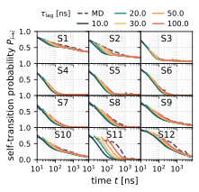
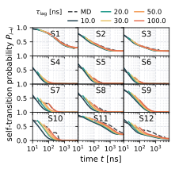
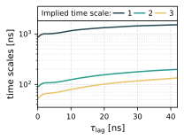
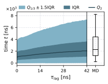
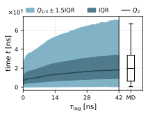
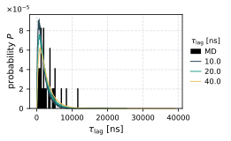

# Markov State Analysis

In this directory you find a script to perform the dynamical Markov state model
analysis shown in Nagel et al. 2023 and the script `perform_msm` to reproduce
the results.

## Timescale Analysis
### Resulting Figures
All following figures are obtained using the Hummer-Szabo projection. To compare with the results obtained without the H-S projection, please refer to the [images](images) directory.


| | Dihedral-Based States | Contact-Based States |
| :---: | :---: | :---: |
| CK-test |  |  |
| Implied Timescales |  |  |
| Waiting Time Distribution |  |  |
| Waiting Times |  |  |

### How to Estimate
All analysis tools are included in the Python package
[msmhelper](https://moldyn.github.io/msmhelper/) and they can be used with its
command-line interface. For more details and installation instructions please
refer to the package documentation.

1. Estimating the Chapman-Kolmogorov tests
    ```bash
    python -m msmhelper ck-test --frames-per-unit 5 --unit ns \  # specify unit
        --max-time 35000 \  # limit of x-axis in [frames]
        --lagtimes 50 100 150 250 500 \  # lagtimes given in [frames]
        --grid 4 3 \  # number of rows and cols
        --filename macrostates \  # path tp macrostate trajectory
        --microfilename microstates  # if this line is neglected, the HS-projection will not be used
    ```
1. Estimating the implied timescales
    ```bash
    python -m msmhelper implied-timescales --frames-per-unit 5 --unit ns \  # specify unit
        --max-lagtime 210 \  # limit of x-axis in [frames]
        --n-lagtimes 3 \  # no of timescales to plot
        --ylog \  # use logscale
        --filename macrostates \  # path tp macrostate trajectory
        --microfilename microstates  # if this line is neglected, the HS-projection will not be used
    ```
1. Estimating the waiting time distribution as a function of the lag time
    ```bash
    python -m msmhelper waiting-time-dist --frames-per-unit 5 --unit ns \  # specify unit
        --nsteps 100000000 \  # number of steps to propagate MCMC
        --start 12 --final 1 \  # states to start and end in
        --max-lagtime 210 \  # limit of x-axis in [frames]
        --filename macrostates \  # path tp macrostate trajectory
        --microfilename microstates  # if this line is neglected, the HS-projection will not be used
    ```
1. Estimating the waiting time distribution for given lag times
    ```bash
    python -m msmhelper waiting-times --frames-per-unit 5 --unit ns \  # specify unit
        --nsteps 100000000 \  # number of steps to propagate MCMC
        --start 12 --final 1 \  # states to start and end in
        --lagtimes 50 100 200 \  # lagtimes to estimate waiting times from, in [frames]
        --filename macrostates \  # path tp macrostate trajectory
        --microfilename microstates  # if this line is neglected, the HS-projection will not be used
    ```

## Reproduce the Results
To reproduce these results you simply have to run
```bash
# this will create automatically a new Python environment
bash perform_msm -c 1
```
This creates a Python environment
with all needed dependencies in the directory `create_msm_nagel23`, and creates all figures. If more information on
the executed commands is needed, please run the script in the verbose mode
`-v`.
